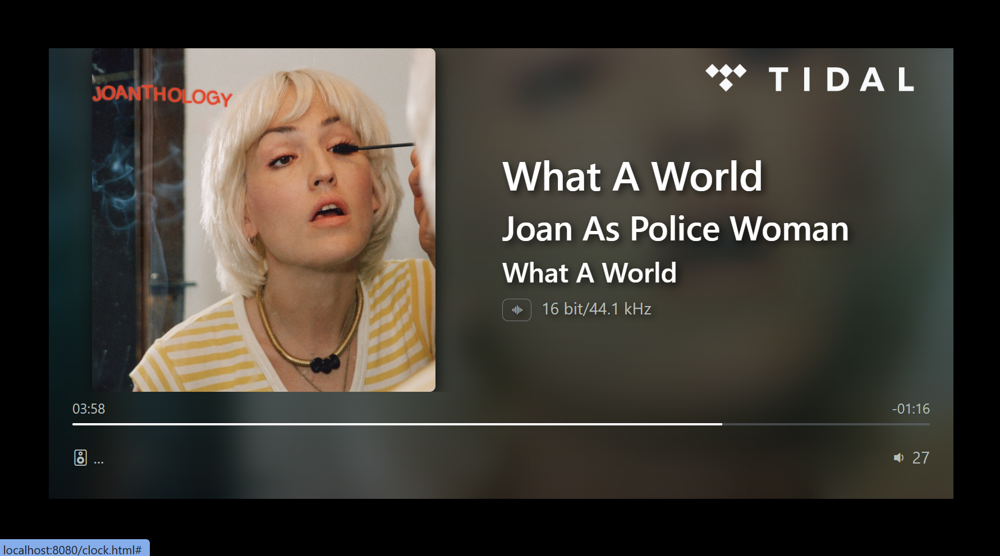

# Static 'now playing' display for WiiM streamers

This is a hobby project and this is for you if you would like to reuse your old android tablet or phone as a display of your WiiM streamer and you are not an experienced html, css, and nodejs developer like me.  
The solution based on the https://github.com/cvdlinden/wiim-now-playing repository by cvdlind. This display is much more simpler, there is no uPnP and SSDP support so the device ip address must be setup manually. The layout is not responsive and also much more simpler. My solution uses the official WiiM API to gather the necessary playing info. (https://www.wiimhome.com/pdf/HTTP%20API%20for%20WiiM%20Products.pdf)

Typical WiiM content:


The flip clock


## Features:
* album cover handling
* album, title, subtitle and artist display
* progress bar for the current playing position
* volume and device name display
* content source icons (tidal, spotify, etc.)
* html based solution, available on pc, tablets, phones, raspberry
* over the air config capability
* auto start and auto full screen mode on android
* screen brightness control on android
* configurable margins to reduce the visible surface
* management for different player states
* fade in/out between the different display states 
* flip clock support

# Easiest way to test the stuff (just run it here and now)

Test the prerequisites:  
Open a bash or a power shell window and type the followings:
```
git -v
> git version 2.51.1.windows.1
node -v 
> v22.20.0
npm -v
> 10.9.3
```

The version numbers must be the same or higher then the above ones.

Install and run the WiiM display:
```
git clone https://github.com/tczagany/wiim-display.git
cd wiim-display
npm install
node server/index.js
> Web Server started at http://localhost:8080
```

Open the following site from any web browser: http://localhost:8080

## Prerequisites on Linux/Windows:
* Git, NodeJs, Npm, Android Debug Bridge ADB (opt.), VSCode (opt.)

## Prerequisites on Android 8 (Oreo) and above:
* Android: F-Droid, Termux, Termux:boot, Fully Kiosk Browser
* In Termux console: Git, NodeJs

## Installation on Android:
* Activate development mode
* Install prerequisites:
  * Download F-Droid apk from F-Droid site and install it
  * Install Termux from F-Droid
  * Install Termux:boot from F-Droid
  * Install Fully Kiosk Browser from Play Store

* Start the termux console
* Clone WiiM-Display to your home directory
```
git clone https://github.com/tczagany/wiim-display.git
```
* Install the project dependencies
```
cd wiim-display
npm install
```

## Setup on Android

* Start the termux:boot app
* Start the termux console
* Start the wiim-display server
```
cd ~/wiim-display
node server/index.js
```
* Setup autostart for the server
```
cd ~/.termx
mkdir bootcd boot
nano wiim-display-autostart.sh
> in nano:
> termux-wake-lock
> node ~/wiim-display/server/index.js
> Ctrl-s; Ctrl-x
```

* Start the Fully Kiosk Browser app
  * Enter into the settings menu (left swipe)
  * In web content settings: start url = http://localhost:8080
  * In web browsing settings: wait for network connection = true
  * Web zoom and scaling: View in desktop mode = true
  * Advanced web settings: Keep screen on while in fullscreen mode = true
  * Device management:
    * Keep screen on = true
    * Unlock screen = true
    * Unlock swipe screen = true
    * Launcsh on boot = true
  * Power settings:
    * Turn screen on on power connect = true
    * Sleep on power disconnect = true

* Deactivate any screen lock to enable the auto starting

After the setup procedure, power off and disconnect the phone from the pc, put the phone on a wall charger and press the power button. All the other tricks must be done automatically.
If the phone loses power, it will go into sleep mode until power is restored.

# Development
## Build steps
```
git clone https://github.com/tczagany/wiim-display.git
cd wiim-display
npm install
cd client
npm install
npm run build
cd ..
node server/index.js
```

